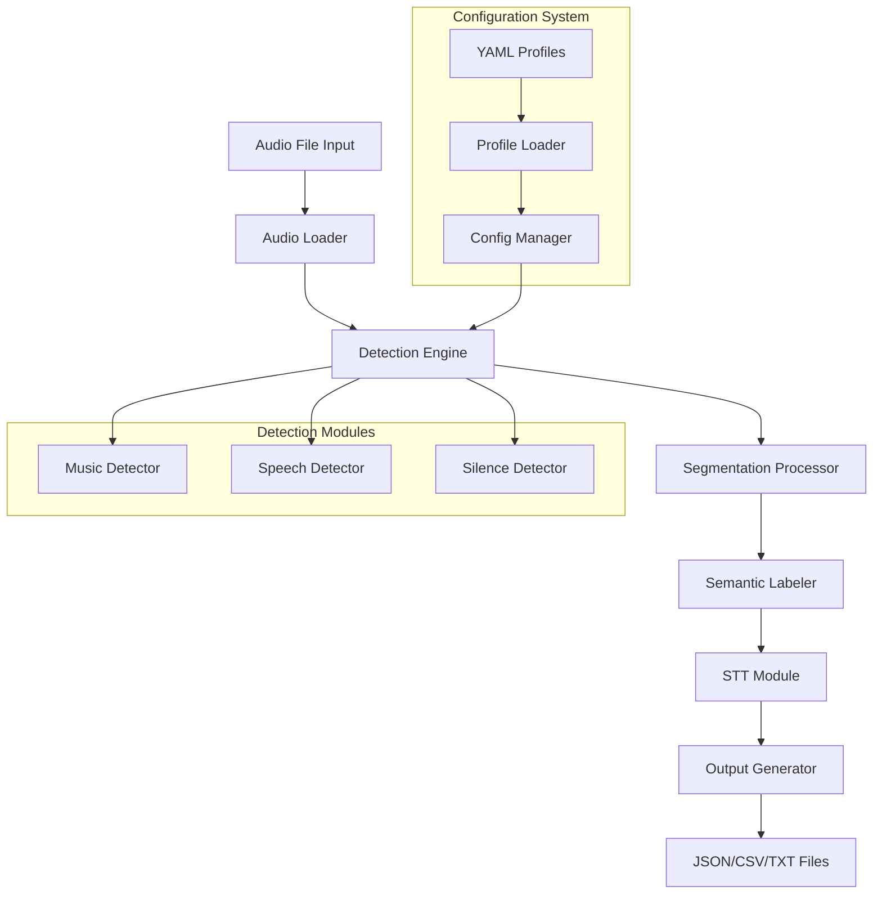
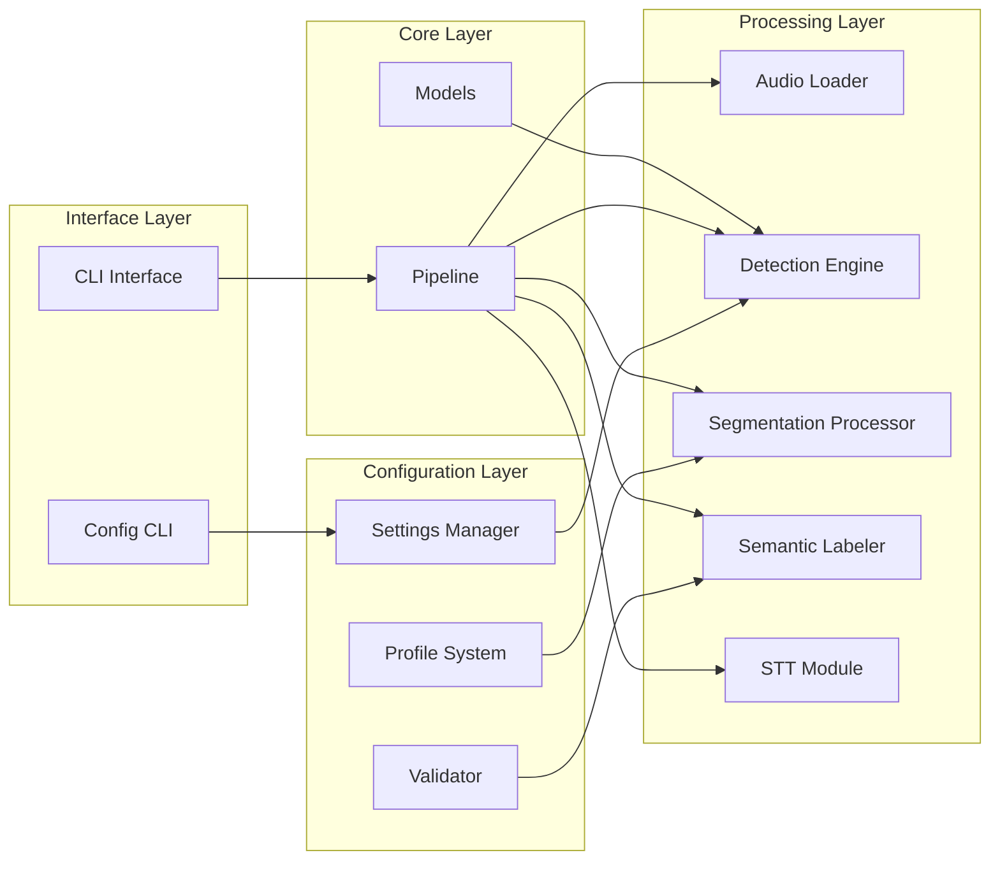
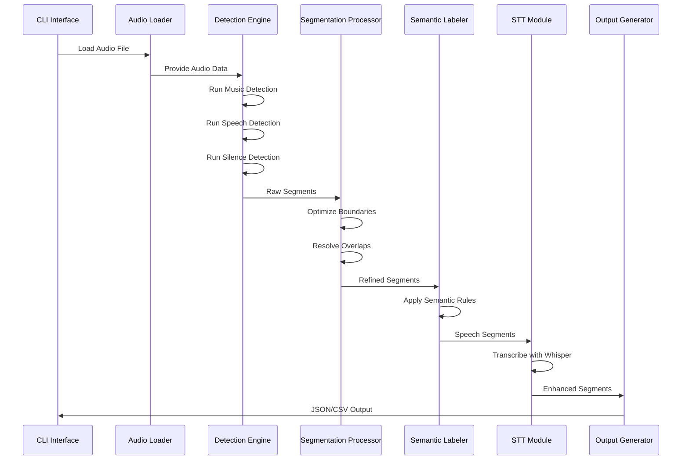

# Local Audio Segmenter - Architecture Documentation

## 📋 Overview

The Local Audio Segmenter is a modular Python application that processes audio files to automatically detect, classify, and segment different types of audio content (music, speech, silence) with optional speech-to-text transcription capabilities.

## 🏗️ System Architecture

### High-Level Architecture



### Module Hierarchy



## 🔧 Core Components

### 1. Audio Loader (`src/audio/loader.py`)

**Purpose**: Loads and preprocesses audio files with format support.

**Key Features**:
- Primary: `librosa` for WAV, MP3, FLAC, OGG
- Fallback: `pydub` for additional formats
- Automatic resampling to target sample rates
- Audio validation and metadata extraction

```python
class AudioLoader:
    def load_audio(self, file_path: str, target_sr: int = None) -> tuple[np.ndarray, int]
    def get_audio_info(self, file_path: str) -> dict
    def validate_file(self, file_path: str) -> bool
```

### 2. Detection Engine (`src/detection/`)

**Purpose**: Identifies audio content types using frame-level analysis.

#### Base Detection Framework (`src/detection/base.py`)

```python
class BaseDetector(ABC):
    def extract_features(self, audio_data: np.ndarray, sr: int) -> np.ndarray
    def detect_segments(self, audio_data: np.ndarray, sr: int) -> list[AudioSegment]
    def smooth_segments(self, segments: list[AudioSegment]) -> list[AudioSegment]
```

#### Music Detector (`src/detection/music_detector.py`)

**Algorithm**: Rule-based classification using audio features
- **Tempo Detection**: BPM > 60 indicates rhythmic content
- **Spectral Analysis**: Centroid > 2000Hz, bandwidth > 1000Hz
- **Zero Crossing Rate**: ZCR < 0.1 for tonal content
- **MFCC Stability**: Stable MFCC coefficients indicate music

```python
def classify_genre(self, features: dict) -> Genre:
    if features['tempo'] > 120 and features['has_percussion']:
        return Genre.ROCK
    elif features['spectral_centroid'] > 2500:
        return Genre.ELECTRONIC
    # ... more classification rules
```

#### Speech Detector (`src/detection/speech_detector.py`)

**Algorithm**: VAD-based speech detection
- **Energy Threshold**: RMS > 0.02 for voiced content
- **Spectral Analysis**: Centroid 500-2000Hz for speech range
- **Zero Crossing**: ZCR > 0.1 for consonant content
- **Speaking Rate**: Words per minute estimation

#### Silence Detector (`src/detection/silence_detector.py`)

**Algorithm**: RMS-based silence detection
- **Default Threshold**: -40 dB RMS
- **Adaptive Threshold**: Configurable based on audio characteristics
- **Boundary Refinement**: Sharp transition detection

### 3. Segmentation Processor (`src/segmentation/processor.py`)

**Purpose**: Refines raw detection results into final segments.

**Key Operations**:
- **Boundary Optimization**: Uses silence detection to refine boundaries
- **Overlap Resolution**: Confidence-based conflict resolution
- **Duration Filtering**: Removes segments shorter than minimum duration
- **Coverage Optimization**: Ensures complete audio timeline coverage

```python
class SegmentationProcessor:
    def process_segments(self,
                        music_segments: list[AudioSegment],
                        speech_segments: list[AudioSegment],
                        config: ProcessingConfig) -> list[AudioSegment]

    def optimize_boundaries(self, segments: list[AudioSegment],
                           silence_segments: list[AudioSegment]) -> list[AudioSegment]

    def resolve_overlaps(self, segments: list[AudioSegment]) -> list[AudioSegment]
```

### 4. Semantic Labeler (`src/semantic/labeler.py`)

**Purpose**: Applies rule-based semantic classification to segments.

**Classification Rules**:
- **Genre Classification**: Rock, Pop, Jazz, Classical, Electronic, etc.
- **Mood Detection**: Happy, Sad, Energetic, Calm, etc.
- **Context-Based Labeling**: Using YAML profile rules

```python
class SemanticLabeler:
    def label_segments(self, segments: list[AudioSegment],
                      profile: dict) -> list[AudioSegment]

    def classify_genre(self, segment: AudioSegment) -> Genre
    def detect_mood(self, segment: AudioSegment) -> Mood
    def apply_profile_rules(self, segments: list[AudioSegment],
                           profile: dict) -> list[AudioSegment]
```

### 5. STT Module (`src/stt/module.py`)

**Purpose**: Provides speech-to-text transcription using Whisper.

**Integration**:
- **Model Support**: tiny, base, small, medium, large Whisper models
- **Language Detection**: Automatic or specified language transcription
- **Batch Processing**: Efficient processing of multiple segments
- **Confidence Scoring**: Whisper confidence mapping to segment confidence

```python
class STTModule:
    def __init__(self, model_size: str = "base", device: str = None, language: str = None)
    def transcribe_audio_array(self, audio_data: np.ndarray, sr: int) -> str
    def transcribe_segments(self, segments: list[SpeechSegment]) -> list[SpeechSegment]
```

### 6. Configuration System (`src/config/`)

**Purpose**: Manages hierarchical configuration with profile support.

#### Profile System

Built-in profiles for different audio scenarios:

**Church Service Profile** (`src/config/profiles/church_service.yaml`):
```yaml
segmentation:
  min_segment_length: 3.0
  max_gap_length: 5.0

music_detection:
  tempo_threshold: 60
  sensitivity: 0.7

semantic_labeling:
  categories:
    sermon:
      min_duration: 300
      confidence_threshold: 0.7
    worship_music:
      min_duration: 60
      confidence_threshold: 0.6
```

**Other Profiles**: `podcast.yaml`, `lecture.yaml`, `meeting.yaml`

## 📊 Data Flow Architecture

### Processing Pipeline



### Data Model

```python
@dataclass
class AudioSegment:
    start_time: float
    end_time: float
    audio_type: AudioType
    confidence: float
    metadata: dict

@dataclass
class MusicSegment(AudioSegment):
    genre: Optional[Genre] = None
    tempo: Optional[float] = None
    key: Optional[str] = None
    instrumentation: Optional[str] = None

@dataclass
class SpeechSegment(AudioSegment):
    transcript: Optional[str] = None
    words_per_minute: Optional[float] = None
    language: Optional[str] = None
```

## 🚨 Current Issues & Architecture Problems

### 1. Over-Categorization Issues

**Root Cause Analysis**:

#### Issue A: Independent Detector Operations
```python
# Current Problem: Detectors run independently
music_segments = music_detector.detect_segments(audio, sr)
speech_segments = speech_detector.detect_segments(audio, sr)
# No coordination between detectors
```

#### Issue B: Overlap Resolution Logic
```python
# Current simplistic approach (src/detection/base.py:278)
def _resolve_overlaps(segments):
    # Keep highest confidence segment
    return sorted(segments, key=lambda x: x.confidence, reverse=True)
```

#### Issue C: Genre Classification Without Confidence
```python
# Current problem (src/detection/music_detector.py:348)
def classify_genre(self, features):
    # Always classifies, regardless of segment confidence
    if features['tempo'] > 120:
        return Genre.ROCK  # Misclassification risk
```

### 2. Semantic Labeling Conflicts

**Problem**: Multiple semantic rules can match the same segment.

```yaml
# church_service.yaml - Conflicting rules
rules:
  - label: "sermon"
    pattern: {min_duration: 300, confidence_threshold: 0.7}
  - label: "worship_music"
    pattern: {min_duration: 60, confidence_threshold: 0.6}
  # No conflict resolution between these
```

### 3. Segment Boundary Issues

**Problem**: Segments are fragmented without temporal consistency.

```mermaid
gantt
    title Current Fragmentation Issues
    dateFormat X
    axisFormat %s

    section Audio Timeline
    Speech     :0, 10
    Music      :10.2, 15
    Silence    :15.1, 16
    Music      :16.3, 25

    section Problems
    Gap Issue  :crit, 10, 0.2
    Overlap    :crit, 15, 0.2
    Fragmented :crit, 16, 0.3
```

## 🔧 Suggested Architectural Improvements

### 1. Coordinated Detection Framework

```python
class CoordinatedDetectionEngine:
    def __init__(self, detectors: list[BaseDetector]):
        self.detectors = detectors
        self.conflict_resolver = ConflictResolver()

    def detect_coordinated(self, audio: np.ndarray, sr: int) -> list[AudioSegment]:
        # Run all detectors simultaneously
        raw_results = [d.detect_segments(audio, sr) for d in self.detectors]

        # Apply sophisticated conflict resolution
        return self.conflict_resolver.resolve(raw_results)
```

### 2. Context-Aware Classification

```python
class ContextAwareClassifier:
    def classify_with_context(self, segments: list[AudioSegment]) -> list[AudioSegment]:
        # Consider temporal context
        # Apply smoothing across boundaries
        # Validate genre classifications
        pass
```

### 3. Hierarchical Profile System

```yaml
# Enhanced profile structure
church_service:
  base_profile: "general"
  overrides:
    music_detection:
      sensitivity: 0.8  # More sensitive for church music
    speech_detection:
      min_energy: 0.01  # Lower threshold for quiet speech
  semantic_rules:
    sermon:
      requires: {preceding: "silence", following: "music"}
    worship_music:
      requires: {duration: ">30s", has_vocals: false}
```

## 📋 Component Specifications

### Performance Requirements

- **Real-time Processing**: 48-minute audio in ~3 minutes (16x speed)
- **Memory Usage**: < 2GB for 1-hour audio files
- **Accuracy**: >85% classification accuracy on church service content

### Dependencies

**Core Dependencies**:
- `librosa` - Audio processing and feature extraction
- `numpy` - Numerical computing
- `scipy` - Signal processing
- `whisper` - Speech-to-text transcription
- `torch` - ML framework for Whisper
- `PyYAML` - Configuration parsing
- `click` - CLI interface

**Development Dependencies**:
- `pytest` - Testing framework
- `black` - Code formatting
- `mypy` - Type checking

### Configuration Schema

```json
{
  "type": "object",
  "properties": {
    "segmentation": {
      "type": "object",
      "properties": {
        "min_segment_length": {"type": "number", "minimum": 0.1},
        "max_gap_length": {"type": "number", "minimum": 0.0}
      }
    },
    "music_detection": {
      "type": "object",
      "properties": {
        "tempo_threshold": {"type": "number", "minimum": 0},
        "sensitivity": {"type": "number", "minimum": 0.0, "maximum": 1.0}
      }
    }
  }
}
```

## 🎯 Usage Examples

### Basic CLI Usage

```bash
# Basic segmentation
uv run python -m src.cli.main audio.wav

# With transcription
uv run python -m src.cli.main audio.wav --transcribe

# With profile
uv run python -m src.cli.main audio.wav --profile church_service

# Custom configuration
uv run python -m src.cli.main audio.wav \
  --min-segment-length 2.0 \
  --silence-threshold -35 \
  --whisper-model small
```

### Programmatic Usage

```python
from src.core.pipeline import AudioProcessingPipeline
from src.config.settings import ConfigManager

# Load configuration
config_manager = ConfigManager()
config = config_manager.load_profile('church_service')

# Create pipeline
pipeline = AudioProcessingPipeline(config)

# Process audio
result = pipeline.process_audio('sermon.mp3', transcribe=True)

# Access results
segments = result.segments
transcript = result.transcript
```

This architecture provides a solid foundation for audio segmentation while identifying clear areas for improvement to address the over-categorization issues.