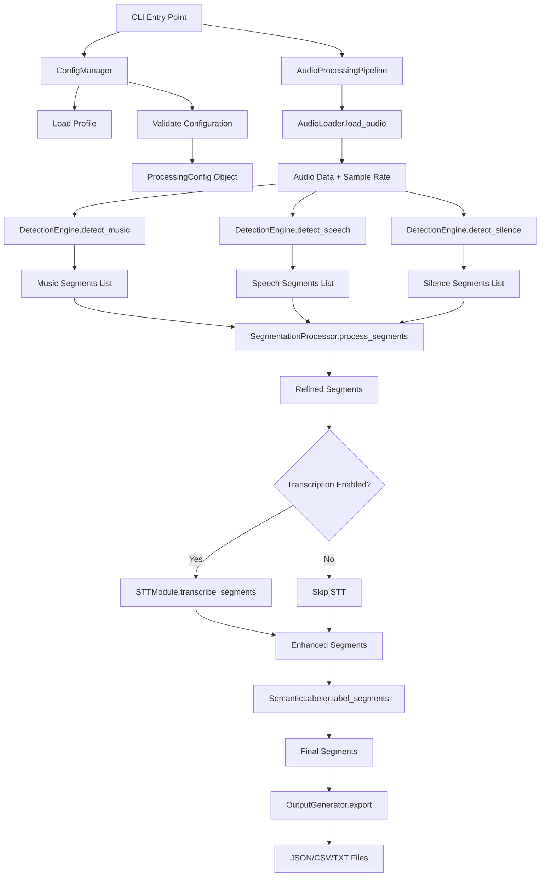
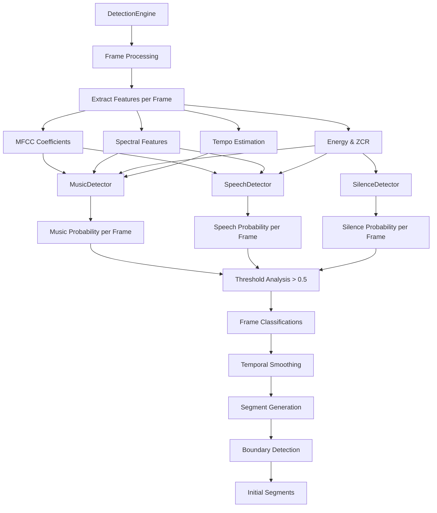
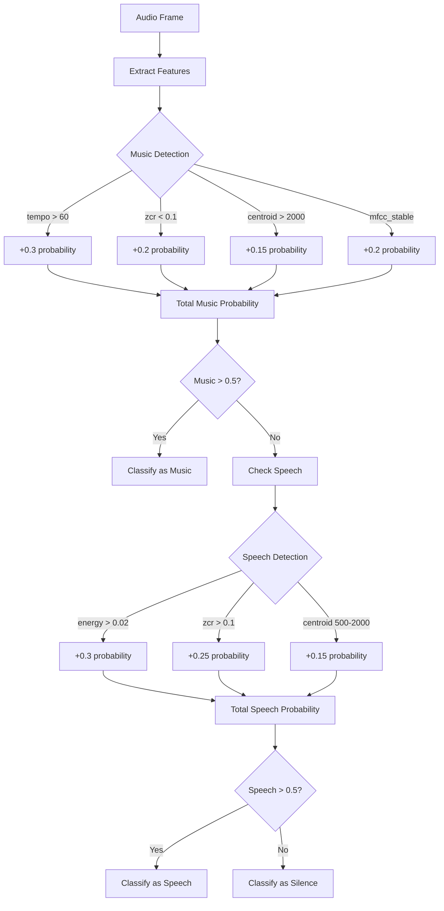
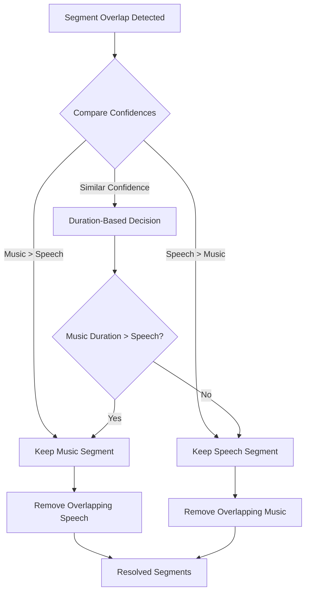
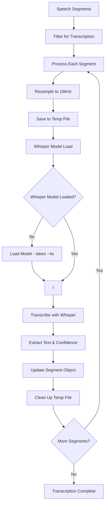
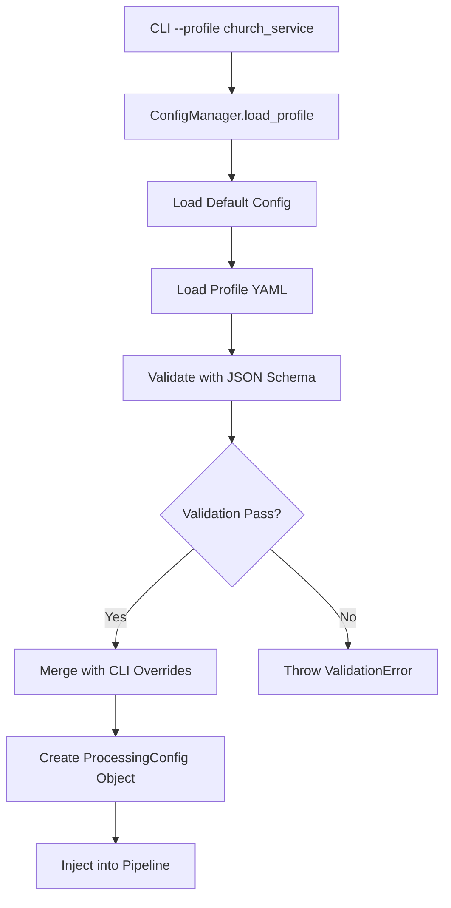
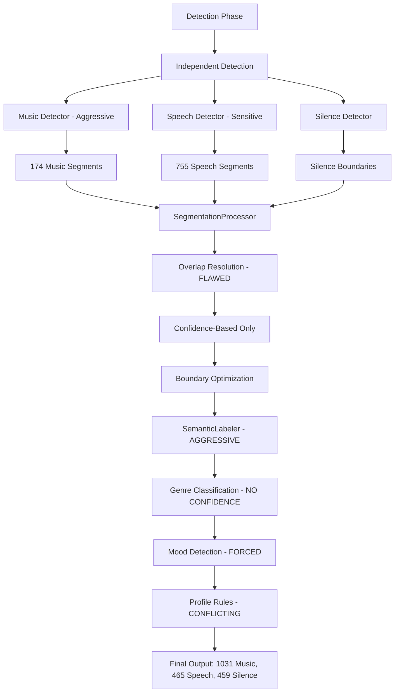
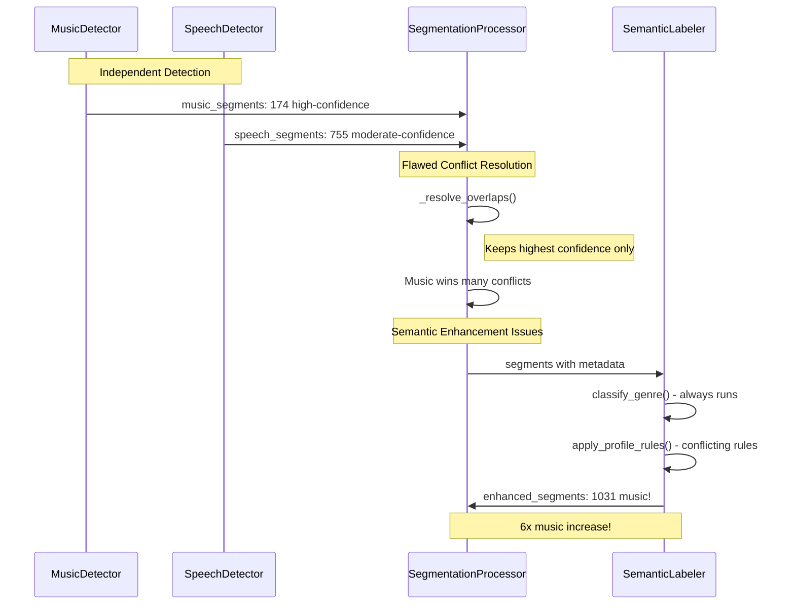
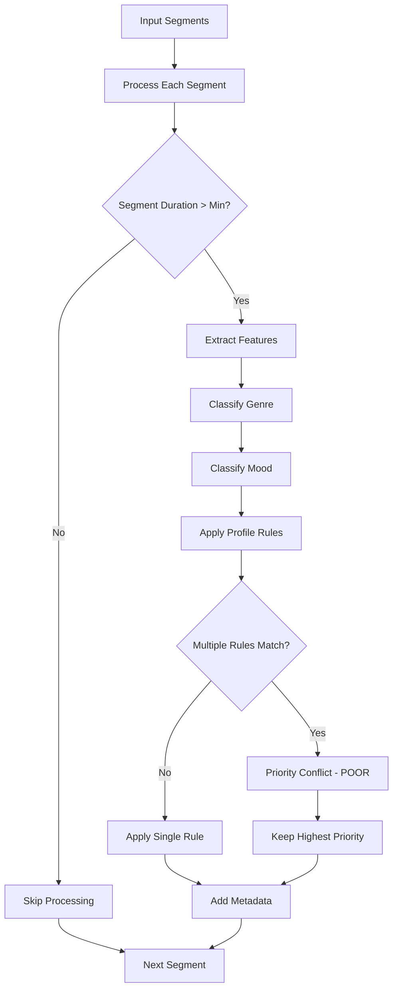
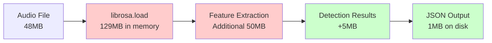

# Implementation Flow Diagrams

## 🔍 Detailed Component Flow

### 1. Main Processing Pipeline Flow



### 2. Detection Engine Internal Flow



### 3. Classification Algorithm Flow



### 4. Overlap Resolution Logic Flow



### 5. STT Module Integration Flow



## 🔧 Configuration Flow

### Profile Loading and Validation



## 🚨 Problem Identification in Current Flow

### 1. Over-Categorization Points



### 2. Current Overlap Resolution Issues



## 🔍 Method-Level Implementation Details

### MusicDetector.detect_segments()

```python
def detect_segments(self, audio_data: np.ndarray, sr: int) -> list[AudioSegment]:
    # 1. Extract frame-level features
    features = self.extract_features(audio_data, sr)

    # 2. Calculate music probability per frame
    music_probs = []
    for frame in features:
        prob = 0.0
        if frame['tempo'] > 60: prob += 0.3
        if frame['zcr'] < 0.1: prob += 0.2
        if frame['spectral_centroid'] > 2000: prob += 0.15
        if frame['mfcc_stable']: prob += 0.2
        if frame['spectral_bandwidth'] > 1000: prob += 0.15
        music_probs.append(prob)

    # 3. Thresholding - PROBLEM HERE
    frames_above_threshold = [i for i, p in enumerate(music_probs) if p > 0.5]

    # 4. Segment generation - PROBLEM HERE
    segments = self._frames_to_segments(frames_above_threshold)

    # 5. Classification - PROBLEM HERE
    for segment in segments:
        segment.genre = self.classify_genre(segment.features)  # Always classifies!

    return segments
```

### SemanticLabeler.label_segments()



### Configuration Problem Points

```yaml
# church_service.yaml - CURRENT PROBLEMS
semantic_labeling:
  rules:
    # PROBLEM: No mutual exclusion between rules
    - label: "sermon"
      confidence_threshold: 0.7
      pattern:
        min_duration: 300  # 5 minutes
        silence_threshold: -35

    # PROBLEM: Conflicts with sermon rule
    - label: "worship_music"
      confidence_threshold: 0.6  # Lower threshold!
      pattern:
        min_duration: 60  # Can overlap with sermon
        has_tempo: true
```

## 📊 Performance Flow Analysis

### Current Processing Times

```mermaid
gantt
    title 48-Minute Audio Processing Timeline
    dateFormat X
    axisFormat %s

    section Loading
    Audio Load :0, 6

    section Detection
    Music Detection :6, 22
    Speech Detection :22, 38
    Silence Detection :38, 42

    section Segmentation
    Boundary Optimization :42, 54

    section Transcription
    STT Processing :54, 390  # ~6 minutes

    section Output
    JSON Export :390, 395
```

### Memory Usage Pattern



This detailed implementation analysis reveals exactly where the over-categorization occurs and provides clear paths for fixing the issues in the detection and classification logic.